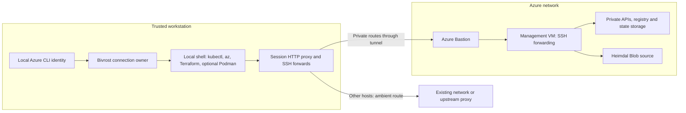
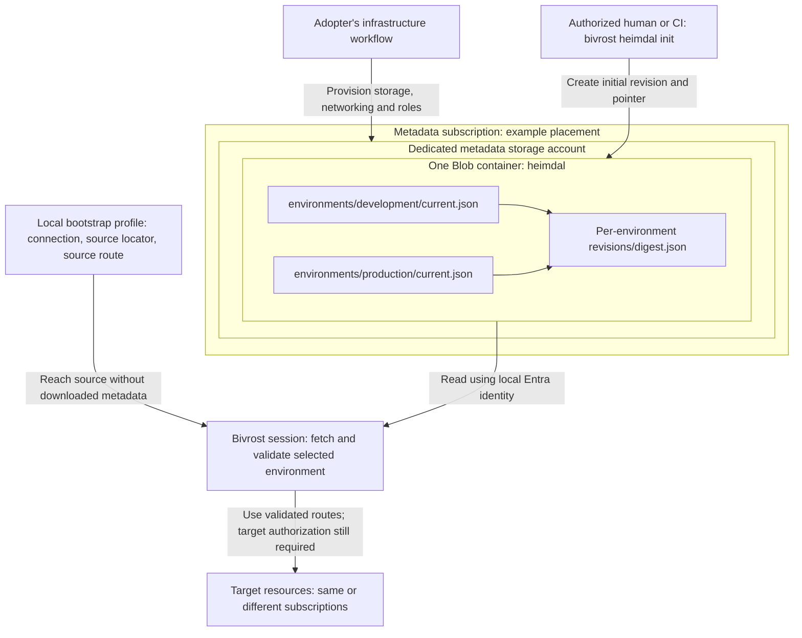
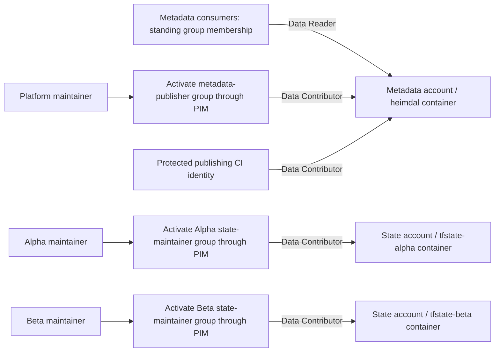
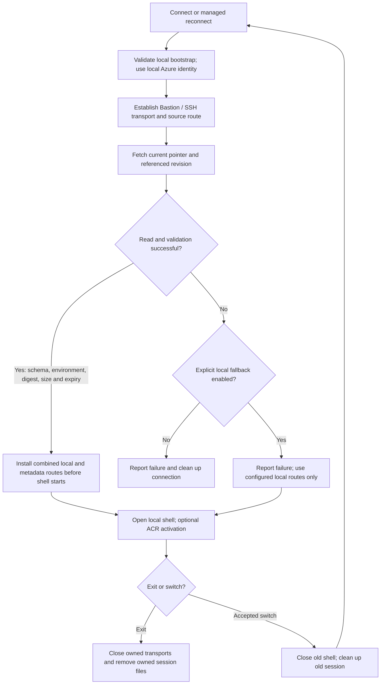

# Bivrost architecture, illustrated

These diagrams describe the development branch. They use fictional teams and
resources; they do not configure a deployment. Heimdal initial publication and
startup retrieval are implemented on `dev`. Ongoing publication/rollback and
Bivrost-managed PIM activation remain planned.

## 1. Where commands run

Bivrost opens a local shell and manages the connection used by its tools.
Heimdal is metadata in Blob Storage, not a server process running on the
management VM.

The diagram shows a private Heimdal source; a source reachable through the
ambient route does not need a private route. Azure and each destination service
still authorize requests. The management VM forwards traffic; it does not run
users' Terraform commands or store their local container images.

The Kubernetes API uses its dedicated forward and session kubeconfig. Podman
registry access is opt-in. These arrows simplify the individual transports;
ordinary loopback forwards do **not** isolate other users or untrusted workloads
on the workstation. See [security boundaries](security-boundaries.md).

## 2. Heimdal storage and bootstrap

This reference design uses a shared metadata account independently of the
subscriptions containing the target resources. It could live in an appropriate
shared-services or non-production subscription; its availability and write
controls matter even when it describes production resources.

**A Blob container holds files; it is not a running Docker/Podman container.**
`heimdal init` requires the storage account and container to exist. It neither
provisions infrastructure nor grants permissions. It refuses to overwrite an
existing pointer. Repeatable updates and rollback are tracked separately in
[issue #31](https://github.com/alcxyz/bivrost/issues/31).

The source subscription is part of the profile, not inferred from the user's
currently selected Azure subscription. Reading a document for production does
not grant production access. One shared container is suitable only when all
its readers may see all those documents: environment prefixes organize data;
they are not access boundaries.

Private-source DNS/network reachability must work through the bootstrap path.
The route to Heimdal cannot be supplied only by the document being fetched.
A deployment also needs a refresh schedule: documents expire, and a one-time
initialization is not a long-term publishing service.

## 3. Who can read or change what

This reference design uses independent groups and container-scoped Azure
**Storage Blob Data** roles. Standing metadata read access keeps connection
setup independent of production PIM. Human write access uses provider-managed
PIM today; Bivrost does not activate or deactivate it.

**PIM determines when a grant is active; its scope determines what it covers.**
Activating one group enables all grants assigned to that group. Do not combine
metadata publishing and team state maintenance into one shared activation group
unless that combined access is intentional.

Arrows show intended grants, not an exhaustive proof of effective access.
A broader inherited grant can defeat this separation; Reader does not cancel
Contributor. Contributor includes deletion. Protect group administration and CI
workflows as well as the role assignments. Deactivation is subject to provider
propagation and token caching, not guaranteed immediate revocation.

Container-per-team is an example, not a migration requirement. Existing teams
sharing a state container must retain their validated blob-level conditions.
Separate accounts alone do not neutralize subscription-wide grants. See the
[adoption guide](heimdal-adoption.md#permission-example) for scope, Shared Key,
CI identity and acceptance checks.

## 4. A connection's lifecycle

This flow applies when the profile contains a Heimdal source. Profiles without
one use their existing local configuration.

Cancellation stops setup even when fallback is enabled. Invalid local source
configuration also fails before fetching. Fallback never uses a cached download.
Retrieved documents stay in memory; every new connection or switch fetches
again. There is no active-shell refresh. Expiry is checked when acquiring the
document; it does not terminate an existing session or revoke resource access.

Switch requests are validated before the old session ends. If a new connection
fails after cleanup, Bivrost returns to the original terminal; it does not
silently restore the previous connection. Cleanup does not revoke Azure login
or erase Podman's registry credentials and image layers. Abrupt termination
can leave owned files behind; see [cleanup boundaries](security-boundaries.md#credentials-and-cleanup).

## Decisions and next steps

- [Heimdal adoption guide](heimdal-adoption.md): provisioning and permission checklist.
- [ADR 0005](adr/0005-session-runtime-metadata.md): metadata contract and local fallback.
- [ADR 0006](adr/0006-pim-jit-lifecycle.md): future PIM lifecycle; not implemented.
- [ADR 0010](adr/0010-managed-session-switch.md): managed reconnect semantics.
- [Roadmap](roadmap/README.md): remaining work and live validation.

Deployment-specific diagrams belong in the adopter's private documentation.
Keep actual account names, group identifiers, subscriptions and network topology
there; these public diagrams describe the reusable design.
