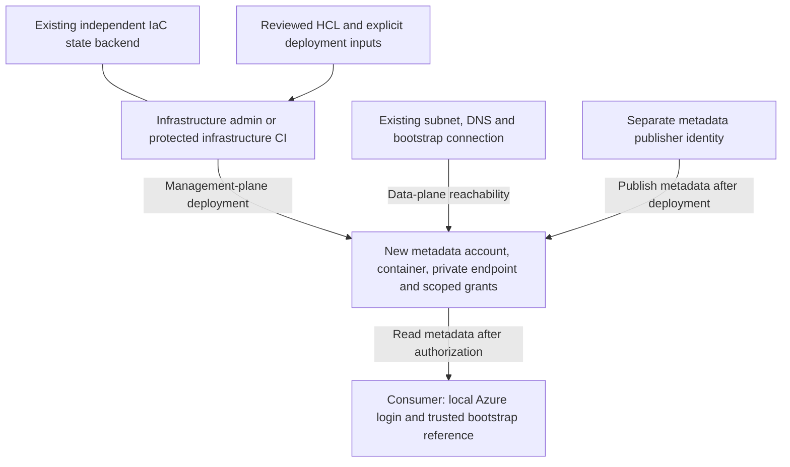

# Heimdal bootstrap reference design

**Design example, not a deployed service or a new CLI command.** The first
reference targets Azure Public Cloud using Terraform/OpenTofu-compatible HCL.
See [ADR 0014](adr/0014-heimdal-bootstrap-reference.md) and the
[example files](../examples/heimdal/azure/). The example still needs disposable
Azure deployment and permission QA before use as a production baseline.

## What bootstrap owns

| Created in the adopter's IaC state | Supplied and managed elsewhere |
| --- | --- |
| Dedicated metadata storage account and Blob service settings | Tenant, subscription, existing resource group |
| Private `heimdal` container (name configurable) | Existing subnet, routing, DNS zone and VNet links |
| Blob private endpoint and its DNS zone association | Existing Bastion/management connection when needed |
| Container-scoped metadata role assignments | Consumer groups, PIM publisher groups, CI identity/federation |
| Credential-free source locator outputs | IaC backend, identity governance, audit destination |

Use a new dedicated account rather than importing a shared account into this
example. The resource group, subnet, DNS zone and identities are references;
they are not owned for future deletion. Changing a reference can still alter
connectivity or authorization and requires plan review.

## Recommended first deployment

The example disables anonymous access, Shared Key authorization and public
network access. It uses a Blob private endpoint, TLS 1.2 minimum and Blob
versioning/soft delete. Retention is a recovery aid, not protection against a
privileged administrator. It is separate from metadata's application expiry.

This is a private-network reference, not a requirement that every adopter use
this topology. A public-endpoint variant needs an explicit design and review;
it is not an automatic fallback if private connectivity fails.

Clients use the ordinary `<account>.blob.core.windows.net` name. The adopter's
DNS and routing must resolve/reach its private endpoint from the management VM
and the publishing runner. Creating a private endpoint alone does not establish
all VNet links, forwarding or cross-network routes. See
[Azure Storage private endpoints](https://learn.microsoft.com/en-us/azure/storage/common/storage-private-endpoints).

## State before storage

The generated infrastructure cannot host its own initial state. Use an existing,
independently managed remote backend with locking and restricted access. Keep
it separate from the metadata container and its consumer roles. Follow the
organization's state encryption, retention and recovery policy. State and saved
plans are sensitive operational artifacts even when outputs contain no credentials;
see [OpenTofu state handling](https://opentofu.org/docs/language/state/sensitive-data/).

The example deliberately has no backend declaration. **Do not apply it with the
implicit local backend for a shared deployment.** Add your reviewed backend
configuration in the downstream copy before initializing for deployment. A
throwaway validation run can use `init -backend=false`; that does not prepare
state for deployment. Do not place credentials in `.tfvars` or backend arguments.

An adopter choosing local state for an isolated experiment must protect and
retain it deliberately; Bivrost will not recover its ownership from Azure tags.
Never recreate missing state by rerunning against existing resources blindly.

## Identity and permission inputs

Supply explicit tenant and subscription IDs, region, account name, resource
group, subnet and DNS zone references. Do not rely on the selected Azure CLI
subscription. Names and IDs are downstream data, never values committed here.

There are three independent operating identities:

1. **Infrastructure administrator/CI:** may create the specified resources,
   associate the endpoint with the supplied network/DNS, and assign the declared
   roles at their intended scopes. Its rights are broader than publishing rights;
   determine the exact grants through the adopter's policy, not a blanket Owner
   recommendation. Required resource providers must already be registered; automatic registration
   is disabled in the example. This first example requires its referenced subnet
   and DNS zone to be in the metadata subscription. Cross-subscription networking
   needs a separately reviewed adaptation.
2. **Metadata publisher:** container-scoped Storage Blob Data Contributor. Human
   maintainers use a group whose eligibility and activation policies are already
   managed through PIM. CI uses an existing protected workload identity.
3. **Consumer:** container-scoped Storage Blob Data Reader. Standing membership
   can avoid an activation dependency for metadata reads when all consumers may
   see the shared catalogue. Target resource access remains separate.

The example assigns roles to supplied principals. **It does not create PIM
eligibility or enforce MFA/approval.** Passing an ordinary standing-membership
group as a publisher grants its members standing publishing access. Establish
and verify group governance before applying. Contributor includes deletion.
Audit inherited grants, group administration and CI workflow control; narrow
assignments do not cancel broader rights. See the
[adoption permission example](heimdal-adoption.md#permission-example).

The routine publisher must not share the infrastructure deployment identity.
Its runner also needs private Blob connectivity; successful OIDC authentication
alone does not provide a network path. Protect federation, publishing branches
and runner access; do not expose either identity to untrusted pull requests.

## Admin workflow

1. Copy the versioned example into the adopter's private infrastructure repository.
   Record the Bivrost revision used. Review variables and ownership boundaries.
2. Set up the independent backend and existing identities/network. Fill in local
   inputs and select either Terraform or OpenTofu consistently for that deployment.
3. Initialize, format, validate and review a plan through the normal IaC workflow.
   Review provider versions and commit the resulting dependency lock file in the
   downstream repository. Do not publish state, plans or filled-in inputs here.
4. Deploy only after review. Re-run the plan to check convergence and inspect
   effective permissions and private connectivity. Static validation cannot
   establish either.
5. Publish the initial metadata separately. Today the development command is
   `bivrost heimdal init`; the planned administrator command is `heimdal publish`.
   See the [current adoption sequence](heimdal-adoption.md#adoption-sequence).
6. Add a renewal workflow once conditional publication is implemented. The current
   create-only initializer cannot maintain an expiring document indefinitely.

Bootstrap generation itself is not implemented. The future command should emit
these reviewable files without applying them or changing cloud authentication.
Existing adopter infrastructure can supply equivalent resources; adopting the
example is not a prerequisite for reading Heimdal metadata.

## Output and onboarding boundary

Infrastructure outputs identify the source account, subscription, tenant,
container and endpoint, plus the resources this state owns. They are **not a
complete onboarding file accepted by Bivrost**. The planned consumer schema is
tracked in [#35](https://github.com/alcxyz/bivrost/issues/35).

An onboarding reference also needs an administrator-approved bootstrap connection
and source trust settings. Infrastructure cannot infer which Bastion/management
path a user should trust from a storage account alone. The eventual generator
must combine these explicit inputs and validate the reference before claiming
it is ready for `bivrost heimdal init --source ...`.

Until then, use the existing profile's `heimdal` locator and local private-source
route as documented in [the current profile example](../README.md#fetch-metadata-when-connecting-development).
The storage account may be in a different subscription from the connection target.
Keep both choices explicit. No downloaded metadata may be needed to reach its
own source.

## Validation gates before wider adoption

Use synthetic metadata in disposable resources:

- Validate both HCL engines; plan/apply with the chosen downstream engine and
  then verify a no-change plan. Confirm only intended resources/grants are owned.
- Confirm the ordinary Blob hostname resolves privately from the actual readers
  and publisher; confirm public access and Shared Key access remain disabled.
- Verify consumer read succeeds and write/delete fail; activated publisher writes
  succeed and its metadata grant provides no Terraform-state access.
- Verify the human publisher's PIM boundary, broader grants and eventual
  deactivation behavior rather than assuming the template proves them.
- Exercise initialization, expired metadata, missing source, fresh reconnect and
  explicit local fallback. Add end-to-end user discovery once #35 exists.
- Review diagnostic logging destinations and retention with the adopter; this
  example does not create an organization-wide audit pipeline.

Retirement remains [#36](https://github.com/alcxyz/bivrost/issues/36). Keep state
and ownership records so it can later use a reviewed teardown; no destroy helper
or automated deletion is provided here.
